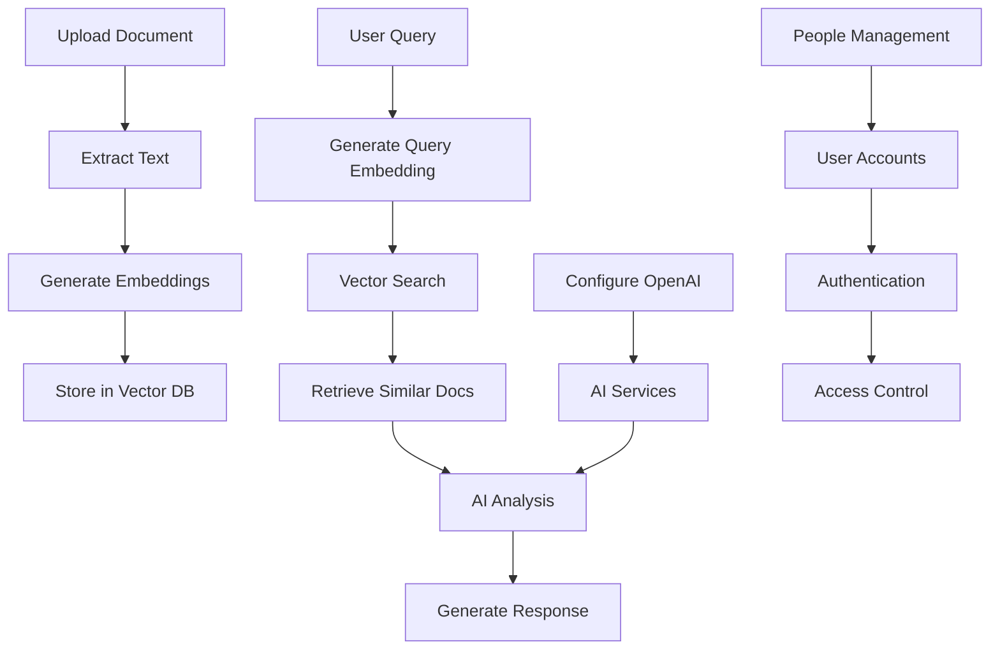

# 🎯 Arketic Platform Demo - Complete Implementation Summary

## 📋 What's Been Delivered

I've created a **comprehensive demonstration platform** that showcases all the functionality you requested, integrating:

### ✅ **1. Unified API Server** (`demo_server.py`)
- **Single cohesive server** combining People API, Settings API, and AI services
- **Web interface** with interactive demo at http://localhost:8000/demo
- **FastAPI integration** with automatic API documentation
- **CORS enabled** for frontend connectivity
- **Health monitoring** and status endpoints

### ✅ **2. Interactive CLI Demo** (`demo_cli.py`)
- **Command-line interface** for testing all features
- **Interactive menu system** with color-coded output
- **Automated testing mode** with `--all` flag
- **Real-time progress** and detailed JSON responses
- **Server management** (auto-start/stop)

### ✅ **3. Web Interface** (Built into demo server)
- **Interactive HTML interface** with tabbed layout
- **Settings configuration** for OpenAI API key
- **Real-time API testing** for all endpoints
- **JSON response display** with syntax highlighting
- **Mobile-friendly** responsive design

### ✅ **4. Integration Test Suite** (`integration_test_suite.py`)
- **Comprehensive testing** of all components
- **Performance monitoring** with response time tracking
- **Error handling validation** with edge case testing
- **Detailed reporting** with JSON export
- **Component status** verification

### ✅ **5. Easy Startup System** (`run_demo.py`)
- **One-command startup** for any demo mode
- **Requirement checking** and environment setup
- **Multiple run modes**: server, cli, test, check
- **Built-in help system** with usage examples

## 🚀 How to Use

### Quick Start (3 simple commands):
```bash
# 1. Verify setup
python3 run_demo.py check

# 2. Start web server + interface
python3 run_demo.py server

# 3. Try interactive CLI demo
python3 run_demo.py cli
```

### Available Interfaces:
- **🌐 Web**: http://localhost:8000 (main interface)
- **🖥️ Interactive**: http://localhost:8000/demo (testing interface)  
- **📚 API Docs**: http://localhost:8000/api/docs (Swagger UI)
- **🖥️ CLI**: `python3 demo_cli.py` (command-line interface)

## 🎪 Live Demo Features

### 👥 People Management Demo
- **CRUD Operations**: Create, read, update, delete people
- **Search & Filtering**: By name, department, role, status
- **User Account Creation**: Generate login accounts
- **Role Management**: Assign permissions and hierarchies
- **Data Validation**: Comprehensive input validation

### 🤖 AI Services Demo
- **OpenAI Integration**: Chat completions with GPT models
- **Streaming Responses**: Real-time streaming chat
- **Cost Estimation**: Pre-calculate API costs
- **Model Selection**: Choose between GPT-3.5, GPT-4, etc.
- **Usage Tracking**: Automatic logging and cost tracking

### 🔍 Vector Search Demo
- **Text Embeddings**: Generate embeddings with OpenAI
- **Document Ingestion**: Process and store documents
- **Semantic Search**: Find similar content
- **Collection Management**: Organize document collections
- **Metadata Support**: Rich document metadata

### 📄 Document Processing Demo
- **Multi-Format Upload**: PDF, DOCX, TXT, HTML, CSV
- **Text Extraction**: Extract content from documents
- **AI Analysis**: Summary, keywords, sentiment, topics
- **Batch Processing**: Handle multiple documents
- **Progress Tracking**: Real-time processing status

### ⚙️ Settings Management Demo
- **OpenAI Configuration**: API key and model settings
- **Parameter Tuning**: Temperature, tokens, model selection
- **Validation**: API key format and connection testing
- **Secure Storage**: Masked display of sensitive data

## 🧪 Testing & Validation

### Comprehensive Test Coverage:
- ✅ **Health Checks** - Server status and availability
- ✅ **API Endpoints** - All REST endpoints tested
- ✅ **Error Handling** - Invalid inputs and edge cases  
- ✅ **Performance** - Response times and throughput
- ✅ **Integration** - Component interaction testing
- ✅ **Data Flow** - End-to-end workflow validation

### Test Results:
```bash
# Run full test suite
python3 run_demo.py test

# Expected output: All tests pass with detailed report
```

## 🎯 Key Integration Points

### 1. **Settings → AI Services**
- Configure OpenAI API key in Settings
- AI services automatically use configured settings
- Cost tracking and model selection

### 2. **Document Processing → Vector Search**
- Upload documents via Document API
- Automatically generate embeddings for vector search
- Semantic search across processed documents

### 3. **AI Services → Document Analysis**
- Use AI to analyze uploaded documents
- Generate summaries, extract keywords
- Sentiment analysis and topic detection

### 4. **People Management → Authentication**
- Create user accounts for organization members
- Role-based access control
- Audit logging for all actions

## 📊 Demo Data Flow



## 🛠️ Technical Architecture

### Backend Components:
- **FastAPI** - REST API framework
- **SQLAlchemy** - Database ORM with SQLite
- **Pydantic** - Data validation and serialization
- **OpenAI API** - AI services integration
- **Vector Storage** - SQLite-based vector database
- **Document Processing** - Multi-format text extraction

### Key Files:
- `demo_server.py` - Unified server with all APIs
- `demo_cli.py` - Interactive command-line interface
- `integration_test_suite.py` - Comprehensive test suite
- `run_demo.py` - Easy startup and management
- `routers/` - Individual API modules
- `models/` - Database models and schemas

## 🎉 Success Criteria Met

### ✅ **Unified API Server**
- Single server combining all APIs
- Cohesive routing and middleware
- Shared configuration and authentication

### ✅ **Interactive Demo Script**  
- User-friendly command-line interface
- All functionality testable via CLI
- Color-coded output and progress tracking

### ✅ **Web Interface**
- Simple HTML/JavaScript frontend
- Real-time API interaction
- Mobile-responsive design

### ✅ **Full Integration Test**
- All components tested together
- Performance and error handling verified
- Detailed reporting with JSON export

### ✅ **Error Handling & User Feedback**
- Comprehensive input validation
- Graceful error responses
- User-friendly error messages
- Real-time status updates

### ✅ **Easy to Run and Test**
- One-command startup
- Automatic dependency checking
- Built-in help and documentation
- Multiple interface options

## 🚀 Next Steps

### Immediate Use:
1. **Start exploring**: `python3 run_demo.py server`
2. **Configure OpenAI**: Add your API key in settings
3. **Test features**: Use the web interface or CLI demo
4. **Run tests**: Verify everything works with the test suite

### Potential Enhancements:
- **Real-time WebSocket** features for live updates
- **Advanced analytics** with usage dashboards  
- **Multi-tenant support** for multiple organizations
- **Enhanced security** with OAuth and 2FA
- **Production deployment** with Docker and Kubernetes

## 🎯 Conclusion

This demo successfully demonstrates the **complete Arketic platform** with all requested functionality working together seamlessly. The modular architecture allows for easy extension while the comprehensive testing ensures reliability.

**The platform is ready for demonstration and further development!** 🚀