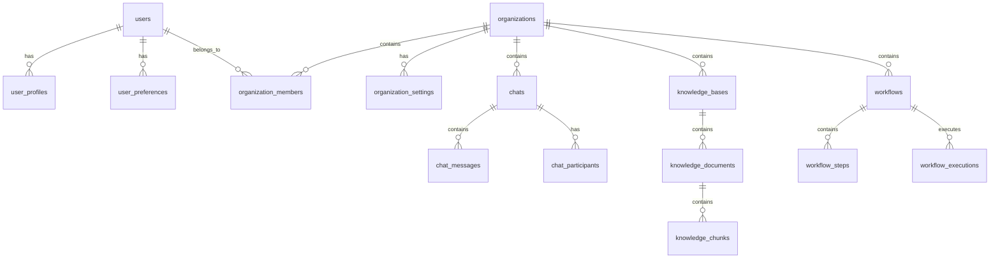

# Arketic Backend Database Schema Documentation

This document provides comprehensive documentation for the Arketic backend database schema, including table definitions, relationships, indexes, and usage patterns.

## Overview

The Arketic database is designed to support a modern AI-powered platform with multi-tenancy, real-time chat, knowledge management, document processing, and workflow automation capabilities. The schema is built using PostgreSQL with proper normalization, constraints, and performance optimizations.

## Schema Architecture

The database follows a modular architecture with clear separation of concerns:

- **User Management**: Authentication, profiles, and preferences
- **Organization Management**: Multi-tenant organizations with role-based access
- **Communication**: Real-time chat with AI integration
- **Knowledge Management**: Document storage and vector search capabilities
- **Workflow Automation**: Process automation and execution tracking
- **Document Management**: File storage with versioning and metadata

## Table Definitions

### User Management

#### `users`
Core user authentication and profile information.

| Column | Type | Constraints | Description |
|--------|------|-------------|-------------|
| `id` | UUID | PRIMARY KEY | Unique user identifier |
| `email` | VARCHAR(255) | UNIQUE, NOT NULL | User email address |
| `username` | VARCHAR(50) | UNIQUE | Optional username |
| `password_hash` | VARCHAR(255) | NOT NULL | Hashed password |
| `first_name` | VARCHAR(100) | NOT NULL | User's first name |
| `last_name` | VARCHAR(100) | NOT NULL | User's last name |
| `role` | ENUM(UserRole) | NOT NULL | System role (super_admin, admin, user, viewer) |
| `status` | ENUM(UserStatus) | NOT NULL | Account status |
| `is_verified` | BOOLEAN | DEFAULT FALSE | Email verification status |
| `is_active` | BOOLEAN | DEFAULT TRUE | Account active status |
| `created_at` | TIMESTAMP | NOT NULL | Creation timestamp |
| `updated_at` | TIMESTAMP | NOT NULL | Last update timestamp |
| `last_login_at` | TIMESTAMP | NULL | Last login timestamp |
| `email_verified_at` | TIMESTAMP | NULL | Email verification timestamp |
| `password_changed_at` | TIMESTAMP | NOT NULL | Password change timestamp |
| `failed_login_attempts` | INTEGER | DEFAULT 0 | Failed login counter |
| `locked_until` | TIMESTAMP | NULL | Account lock expiration |
| `two_factor_enabled` | BOOLEAN | DEFAULT FALSE | 2FA status |
| `two_factor_secret` | VARCHAR(32) | NULL | 2FA secret key |

**Indexes:**
- `idx_user_email_status` on (email, status)
- `idx_user_role_status` on (role, status)
- `idx_user_created_at` on (created_at)

#### `user_profiles`
Extended user profile information.

| Column | Type | Constraints | Description |
|--------|------|-------------|-------------|
| `id` | UUID | PRIMARY KEY | Profile identifier |
| `user_id` | UUID | FOREIGN KEY, UNIQUE | Reference to users table |
| `avatar_url` | VARCHAR(500) | NULL | Profile picture URL |
| `bio` | TEXT | NULL | User biography |
| `job_title` | VARCHAR(100) | NULL | Professional title |
| `company` | VARCHAR(100) | NULL | Company name |
| `location` | VARCHAR(100) | NULL | Geographic location |
| `timezone` | VARCHAR(50) | DEFAULT 'UTC' | User timezone |
| `language` | VARCHAR(10) | DEFAULT 'en' | Preferred language |
| `skills` | JSON | NULL | Array of skills |
| `certifications` | JSON | NULL | Array of certifications |
| `experience_years` | INTEGER | NULL | Years of experience |

#### `user_preferences`
User application preferences and settings.

| Column | Type | Constraints | Description |
|--------|------|-------------|-------------|
| `id` | UUID | PRIMARY KEY | Preference identifier |
| `user_id` | UUID | FOREIGN KEY, UNIQUE | Reference to users table |
| `theme` | VARCHAR(20) | DEFAULT 'light' | UI theme preference |
| `default_ai_model` | VARCHAR(50) | DEFAULT 'gpt-4o' | Preferred AI model |
| `ai_response_style` | VARCHAR(20) | DEFAULT 'balanced' | AI response style |
| `ai_creativity_level` | INTEGER | DEFAULT 5 | AI creativity (1-10) |
| `notifications_enabled` | BOOLEAN | DEFAULT TRUE | Enable notifications |
| `profile_visibility` | VARCHAR(20) | DEFAULT 'organization' | Profile visibility level |
| `custom_settings` | JSON | NULL | Custom user settings |

### Organization Management

#### `organizations`
Multi-tenant organization entities.

| Column | Type | Constraints | Description |
|--------|------|-------------|-------------|
| `id` | UUID | PRIMARY KEY | Organization identifier |
| `name` | VARCHAR(200) | NOT NULL | Organization name |
| `slug` | VARCHAR(100) | UNIQUE, NOT NULL | URL-friendly identifier |
| `description` | TEXT | NULL | Organization description |
| `status` | ENUM(OrganizationStatus) | NOT NULL | Organization status |
| `subscription_tier` | ENUM(SubscriptionTier) | NOT NULL | Subscription level |
| `max_members` | INTEGER | DEFAULT 5 | Maximum member limit |
| `max_storage_gb` | INTEGER | DEFAULT 1 | Storage limit in GB |
| `max_ai_requests_per_month` | INTEGER | DEFAULT 1000 | AI request limit |
| `current_members` | INTEGER | DEFAULT 0 | Current member count |
| `current_storage_mb` | INTEGER | DEFAULT 0 | Current storage usage |
| `ai_requests_this_month` | INTEGER | DEFAULT 0 | Current AI usage |
| `created_at` | TIMESTAMP | NOT NULL | Creation timestamp |
| `trial_ends_at` | TIMESTAMP | NULL | Trial expiration |
| `subscription_ends_at` | TIMESTAMP | NULL | Subscription expiration |

**Indexes:**
- `idx_org_status_tier` on (status, subscription_tier)
- `idx_org_created_at` on (created_at)

#### `organization_members`
Organization membership with roles.

| Column | Type | Constraints | Description |
|--------|------|-------------|-------------|
| `id` | UUID | PRIMARY KEY | Membership identifier |
| `organization_id` | UUID | FOREIGN KEY | Reference to organizations |
| `user_id` | UUID | FOREIGN KEY | Reference to users |
| `role` | ENUM(OrganizationRole) | NOT NULL | Member role |
| `is_active` | BOOLEAN | DEFAULT TRUE | Membership status |
| `invited_by_id` | UUID | FOREIGN KEY | Who invited the member |
| `joined_at` | TIMESTAMP | NOT NULL | Join timestamp |

**Constraints:**
- `uq_org_member` UNIQUE (organization_id, user_id)

**Indexes:**
- `idx_org_member_role` on (organization_id, role)
- `idx_org_member_active` on (organization_id, is_active)

#### `organization_settings`
Organization-specific configuration.

| Column | Type | Constraints | Description |
|--------|------|-------------|-------------|
| `id` | UUID | PRIMARY KEY | Settings identifier |
| `organization_id` | UUID | FOREIGN KEY, UNIQUE | Reference to organizations |
| `default_ai_model` | VARCHAR(50) | DEFAULT 'gpt-4o' | Default AI model |
| `allowed_ai_models` | JSON | NULL | Allowed AI models array |
| `ai_cost_budget_monthly` | DECIMAL(10,2) | DEFAULT 100.00 | Monthly AI budget |
| `require_2fa` | BOOLEAN | DEFAULT FALSE | Require 2FA for members |
| `session_timeout_minutes` | INTEGER | DEFAULT 480 | Session timeout |
| `enable_audit_logging` | BOOLEAN | DEFAULT TRUE | Enable audit logs |
| `data_retention_days` | INTEGER | DEFAULT 365 | Data retention period |
| `enable_workflows` | BOOLEAN | DEFAULT TRUE | Enable workflow features |
| `enable_api_access` | BOOLEAN | DEFAULT FALSE | Enable API access |
| `custom_settings` | JSON | NULL | Custom organization settings |

### Communication System

#### `chats`
Chat conversation containers.

| Column | Type | Constraints | Description |
|--------|------|-------------|-------------|
| `id` | UUID | PRIMARY KEY | Chat identifier |
| `organization_id` | UUID | FOREIGN KEY | Reference to organizations |
| `creator_id` | UUID | FOREIGN KEY | Chat creator |
| `title` | VARCHAR(200) | NOT NULL | Chat title |
| `chat_type` | ENUM(ChatType) | DEFAULT 'direct' | Type of chat |
| `ai_model` | VARCHAR(50) | NULL | AI model for responses |
| `system_prompt` | TEXT | NULL | Custom system prompt |
| `temperature` | DECIMAL(3,2) | DEFAULT 0.7 | AI creativity level |
| `enable_ai_responses` | BOOLEAN | DEFAULT TRUE | Enable AI participation |
| `is_archived` | BOOLEAN | DEFAULT FALSE | Archive status |
| `message_count` | INTEGER | DEFAULT 0 | Total message count |
| `total_tokens_used` | INTEGER | DEFAULT 0 | Total AI tokens used |
| `last_activity_at` | TIMESTAMP | NOT NULL | Last activity timestamp |

**Indexes:**
- `idx_chat_org_type` on (organization_id, chat_type)
- `idx_chat_activity` on (last_activity_at)
- `idx_chat_archived` on (is_archived)

#### `chat_messages`
Individual chat messages.

| Column | Type | Constraints | Description |
|--------|------|-------------|-------------|
| `id` | UUID | PRIMARY KEY | Message identifier |
| `chat_id` | UUID | FOREIGN KEY | Reference to chats |
| `sender_id` | UUID | FOREIGN KEY | Message sender (NULL for AI) |
| `reply_to_id` | UUID | FOREIGN KEY | Reply to message |
| `message_type` | ENUM(MessageType) | DEFAULT 'user' | Type of message |
| `content` | TEXT | NOT NULL | Message content |
| `file_url` | VARCHAR(500) | NULL | Attached file URL |
| `ai_model_used` | VARCHAR(50) | NULL | AI model used |
| `tokens_used` | INTEGER | NULL | AI tokens consumed |
| `processing_time_ms` | INTEGER | NULL | AI processing time |
| `ai_confidence_score` | DECIMAL(5,4) | NULL | AI confidence (0-1) |
| `status` | ENUM(MessageStatus) | DEFAULT 'sent' | Message status |
| `is_edited` | BOOLEAN | DEFAULT FALSE | Edit status |
| `is_deleted` | BOOLEAN | DEFAULT FALSE | Deletion status |
| `created_at` | TIMESTAMP | NOT NULL | Creation timestamp |

**Indexes:**
- `idx_message_chat_created` on (chat_id, created_at)
- `idx_message_type` on (message_type)
- `idx_message_status` on (status)

#### `chat_participants`
Chat membership and permissions.

| Column | Type | Constraints | Description |
|--------|------|-------------|-------------|
| `id` | UUID | PRIMARY KEY | Participant identifier |
| `chat_id` | UUID | FOREIGN KEY | Reference to chats |
| `user_id` | UUID | FOREIGN KEY | Reference to users |
| `role` | ENUM(ParticipantRole) | DEFAULT 'member' | Participant role |
| `is_active` | BOOLEAN | DEFAULT TRUE | Participation status |
| `can_send_messages` | BOOLEAN | DEFAULT TRUE | Message permission |
| `can_upload_files` | BOOLEAN | DEFAULT TRUE | File upload permission |
| `last_read_message_id` | UUID | FOREIGN KEY | Last read message |
| `message_count` | INTEGER | DEFAULT 0 | Messages sent count |
| `joined_at` | TIMESTAMP | NOT NULL | Join timestamp |

**Constraints:**
- `idx_participant_chat_user` UNIQUE (chat_id, user_id)

### Knowledge Management

#### `knowledge_bases`
Knowledge base containers for document collections.

| Column | Type | Constraints | Description |
|--------|------|-------------|-------------|
| `id` | UUID | PRIMARY KEY | Knowledge base identifier |
| `organization_id` | UUID | FOREIGN KEY | Reference to organizations |
| `owner_id` | UUID | FOREIGN KEY | Knowledge base owner |
| `name` | VARCHAR(200) | NOT NULL | Knowledge base name |
| `knowledge_base_type` | ENUM(KnowledgeBaseType) | DEFAULT 'shared' | Access type |
| `embedding_model` | VARCHAR(100) | DEFAULT 'text-embedding-3-small' | Embedding model |
| `vector_store_type` | ENUM(VectorStore) | DEFAULT 'chroma' | Vector store type |
| `chunk_size` | INTEGER | DEFAULT 1000 | Document chunk size |
| `chunk_overlap` | INTEGER | DEFAULT 200 | Chunk overlap size |
| `similarity_threshold` | DECIMAL(5,4) | DEFAULT 0.7 | Search similarity threshold |
| `is_public` | BOOLEAN | DEFAULT FALSE | Public access |
| `document_count` | INTEGER | DEFAULT 0 | Total documents |
| `total_chunks` | INTEGER | DEFAULT 0 | Total chunks |
| `total_size_bytes` | INTEGER | DEFAULT 0 | Total size in bytes |
| `is_active` | BOOLEAN | DEFAULT TRUE | Active status |
| `is_indexing` | BOOLEAN | DEFAULT FALSE | Indexing status |

**Indexes:**
- `idx_kb_org_type` on (organization_id, knowledge_base_type)
- `idx_kb_active` on (is_active)
- `idx_kb_public` on (is_public)

#### `knowledge_documents`
Documents within knowledge bases.

| Column | Type | Constraints | Description |
|--------|------|-------------|-------------|
| `id` | UUID | PRIMARY KEY | Document identifier |
| `knowledge_base_id` | UUID | FOREIGN KEY | Reference to knowledge_bases |
| `uploaded_by_id` | UUID | FOREIGN KEY | Document uploader |
| `filename` | VARCHAR(255) | NOT NULL | File name |
| `file_path` | VARCHAR(500) | NOT NULL | Storage path |
| `file_type` | VARCHAR(50) | NOT NULL | File extension |
| `file_size` | INTEGER | NOT NULL | File size in bytes |
| `mime_type` | VARCHAR(100) | NOT NULL | MIME type |
| `status` | ENUM(DocumentStatus) | DEFAULT 'uploading' | Processing status |
| `extracted_text` | TEXT | NULL | Extracted text content |
| `processing_error` | TEXT | NULL | Processing error message |
| `chunk_count` | INTEGER | DEFAULT 0 | Number of chunks |
| `embedding_model_used` | VARCHAR(100) | NULL | Embedding model used |
| `file_hash` | VARCHAR(64) | NULL | SHA-256 hash |
| `content_hash` | VARCHAR(64) | NULL | Content hash |

**Indexes:**
- `idx_doc_kb_status` on (knowledge_base_id, status)
- `idx_doc_file_type` on (file_type)
- `idx_doc_hash` on (file_hash)

#### `knowledge_chunks`
Text chunks for vector search.

| Column | Type | Constraints | Description |
|--------|------|-------------|-------------|
| `id` | UUID | PRIMARY KEY | Chunk identifier |
| `document_id` | UUID | FOREIGN KEY | Reference to knowledge_documents |
| `chunk_index` | INTEGER | NOT NULL | Order within document |
| `chunk_type` | ENUM(ChunkType) | DEFAULT 'text' | Type of chunk |
| `content` | TEXT | NOT NULL | Chunk content |
| `content_length` | INTEGER | NOT NULL | Content length |
| `page_number` | INTEGER | NULL | Source page number |
| `vector_id` | VARCHAR(100) | NULL | Vector store ID |
| `embedding_model` | VARCHAR(100) | NULL | Embedding model |
| `title` | VARCHAR(500) | NULL | Section title |
| `keywords` | JSON | NULL | Extracted keywords |
| `summary` | TEXT | NULL | AI-generated summary |
| `relevance_score` | DECIMAL(5,4) | NULL | Content quality score |

**Indexes:**
- `idx_chunk_doc_index` on (document_id, chunk_index)
- `idx_chunk_vector_id` on (vector_id)
- `idx_chunk_type` on (chunk_type)

### Document Management

#### `documents`
General document storage and management.

| Column | Type | Constraints | Description |
|--------|------|-------------|-------------|
| `id` | UUID | PRIMARY KEY | Document identifier |
| `organization_id` | UUID | FOREIGN KEY | Reference to organizations |
| `owner_id` | UUID | FOREIGN KEY | Document owner |
| `parent_id` | UUID | FOREIGN KEY | Parent folder |
| `name` | VARCHAR(255) | NOT NULL | Document name |
| `document_type` | ENUM(DocumentType) | NOT NULL | Type of document |
| `filename` | VARCHAR(255) | NOT NULL | File name |
| `file_path` | VARCHAR(500) | NOT NULL | Storage path |
| `file_size` | INTEGER | NOT NULL | File size |
| `file_hash` | VARCHAR(64) | NOT NULL | SHA-256 hash |
| `status` | ENUM(DocumentStatusType) | DEFAULT 'uploading' | Processing status |
| `share_level` | ENUM(ShareLevel) | DEFAULT 'private' | Sharing level |
| `folder_path` | VARCHAR(1000) | NULL | Folder hierarchy |
| `version_number` | INTEGER | DEFAULT 1 | Version number |
| `is_latest_version` | BOOLEAN | DEFAULT TRUE | Latest version flag |
| `download_count` | INTEGER | DEFAULT 0 | Download counter |
| `view_count` | INTEGER | DEFAULT 0 | View counter |

**Indexes:**
- `idx_doc_org_status` on (organization_id, status)
- `idx_doc_hash` on (file_hash)
- `idx_doc_folder` on (folder_path)

### Workflow Automation

#### `workflows`
Workflow definitions and configuration.

| Column | Type | Constraints | Description |
|--------|------|-------------|-------------|
| `id` | UUID | PRIMARY KEY | Workflow identifier |
| `organization_id` | UUID | FOREIGN KEY | Reference to organizations |
| `creator_id` | UUID | FOREIGN KEY | Workflow creator |
| `name` | VARCHAR(200) | NOT NULL | Workflow name |
| `version` | VARCHAR(20) | DEFAULT '1.0.0' | Version string |
| `trigger_type` | ENUM(WorkflowTrigger) | DEFAULT 'manual' | Trigger method |
| `status` | ENUM(WorkflowStatus) | DEFAULT 'draft' | Workflow status |
| `max_execution_time` | INTEGER | DEFAULT 3600 | Max execution time (seconds) |
| `retry_attempts` | INTEGER | DEFAULT 3 | Retry attempts |
| `cron_expression` | VARCHAR(100) | NULL | Schedule expression |
| `workflow_definition` | JSON | NOT NULL | Workflow structure |
| `execution_count` | INTEGER | DEFAULT 0 | Total executions |
| `success_count` | INTEGER | DEFAULT 0 | Successful executions |
| `failure_count` | INTEGER | DEFAULT 0 | Failed executions |
| `avg_execution_time` | DECIMAL(10,2) | NULL | Average execution time |

**Indexes:**
- `idx_workflow_org_status` on (organization_id, status)
- `idx_workflow_trigger` on (trigger_type)
- `idx_workflow_next_run` on (next_run_at)

#### `workflow_steps`
Individual workflow steps.

| Column | Type | Constraints | Description |
|--------|------|-------------|-------------|
| `id` | UUID | PRIMARY KEY | Step identifier |
| `workflow_id` | UUID | FOREIGN KEY | Reference to workflows |
| `name` | VARCHAR(200) | NOT NULL | Step name |
| `step_type` | ENUM(StepType) | NOT NULL | Type of step |
| `step_order` | INTEGER | NOT NULL | Execution order |
| `configuration` | JSON | NOT NULL | Step configuration |
| `condition` | TEXT | NULL | Conditional execution |
| `retry_attempts` | INTEGER | DEFAULT 3 | Step retry attempts |
| `timeout_seconds` | INTEGER | DEFAULT 300 | Step timeout |
| `depends_on` | JSON | NULL | Step dependencies |

**Indexes:**
- `idx_step_workflow_order` on (workflow_id, step_order)
- `idx_step_type` on (step_type)

#### `workflow_executions`
Workflow execution instances.

| Column | Type | Constraints | Description |
|--------|------|-------------|-------------|
| `id` | UUID | PRIMARY KEY | Execution identifier |
| `workflow_id` | UUID | FOREIGN KEY | Reference to workflows |
| `triggered_by_id` | UUID | FOREIGN KEY | User who triggered |
| `execution_number` | INTEGER | NOT NULL | Sequential execution number |
| `status` | ENUM(ExecutionStatus) | DEFAULT 'pending' | Execution status |
| `input_data` | JSON | NULL | Input parameters |
| `output_data` | JSON | NULL | Execution results |
| `current_step_id` | UUID | FOREIGN KEY | Currently executing step |
| `completed_steps` | INTEGER | DEFAULT 0 | Steps completed |
| `total_steps` | INTEGER | NOT NULL | Total steps |
| `started_at` | TIMESTAMP | NULL | Start time |
| `completed_at` | TIMESTAMP | NULL | Completion time |
| `duration_seconds` | DECIMAL(10,2) | NULL | Execution duration |
| `error_message` | TEXT | NULL | Error details |

**Indexes:**
- `idx_execution_workflow_number` on (workflow_id, execution_number)
- `idx_execution_status` on (status)
- `idx_execution_started` on (started_at)

## Data Relationships

### Primary Relationships

1. **Users → Organizations**: Many-to-many through `organization_members`
2. **Organizations → Chats**: One-to-many
3. **Chats → Messages**: One-to-many
4. **Chats → Participants**: One-to-many through `chat_participants`
5. **Organizations → Knowledge Bases**: One-to-many
6. **Knowledge Bases → Documents**: One-to-many
7. **Documents → Chunks**: One-to-many
8. **Organizations → Workflows**: One-to-many
9. **Workflows → Steps**: One-to-many
10. **Workflows → Executions**: One-to-many

### Foreign Key Relationships

## Performance Considerations

### Indexing Strategy

1. **Primary Access Patterns**: All primary keys are UUIDs with clustered indexes
2. **Query Optimization**: Composite indexes on frequently queried column combinations
3. **Foreign Key Performance**: All foreign keys have corresponding indexes
4. **Search Optimization**: Full-text search indexes on content fields
5. **Time-based Queries**: Indexes on timestamp columns for time-range queries

### Scaling Considerations

1. **Partitioning**: Large tables like `chat_messages` can be partitioned by date
2. **Read Replicas**: Read-heavy queries can use database replicas
3. **Caching**: Frequently accessed data cached in Redis
4. **Connection Pooling**: Proper connection pool sizing for concurrent users
5. **Query Optimization**: Regular EXPLAIN ANALYZE on slow queries

## Security Features

### Data Protection

1. **Encryption**: Sensitive fields encrypted at rest
2. **Access Control**: Row-level security for multi-tenant isolation
3. **Audit Logging**: All data modifications logged
4. **Backup Security**: Encrypted backups with retention policies
5. **Connection Security**: SSL/TLS for all database connections

### Privacy Compliance

1. **Data Retention**: Configurable retention periods per organization
2. **Data Export**: GDPR-compliant data export functionality
3. **Right to Deletion**: Cascading deletes for user data removal
4. **Anonymization**: User data can be anonymized while preserving analytics

## Backup and Recovery

### Backup Strategy

1. **Full Backups**: Daily full database backups
2. **Incremental Backups**: Hourly incremental backups
3. **Point-in-Time Recovery**: WAL archiving for precise recovery
4. **Cross-Region Replication**: Backups replicated to multiple regions
5. **Retention Policy**: Configurable backup retention periods

### Disaster Recovery

1. **RTO Target**: 4 hours recovery time objective
2. **RPO Target**: 1 hour recovery point objective
3. **Failover Process**: Automated failover to standby instances
4. **Data Validation**: Automated data integrity checks post-recovery

## Monitoring and Maintenance

### Performance Monitoring

1. **Query Performance**: Slow query logging and analysis
2. **Connection Monitoring**: Active connection tracking
3. **Resource Usage**: CPU, memory, and disk monitoring
4. **Index Usage**: Regular index usage analysis
5. **Lock Monitoring**: Deadlock detection and resolution

### Maintenance Tasks

1. **VACUUM**: Regular table maintenance for performance
2. **ANALYZE**: Statistics updates for query optimization
3. **Index Maintenance**: Rebuilding fragmented indexes
4. **Archive Management**: Old data archival and purging
5. **Schema Evolution**: Managed schema migrations

## Migration and Deployment

### Schema Versioning

1. **Alembic Integration**: Database migrations managed by Alembic
2. **Version Control**: All schema changes version controlled
3. **Migration Testing**: Migrations tested in staging environments
4. **Rollback Plans**: Reversible migrations for safe deployments
5. **Zero-Downtime**: Online schema changes where possible

### Environment Management

1. **Development**: Local development with seed data
2. **Staging**: Production-like environment for testing
3. **Production**: High-availability production setup
4. **Testing**: Isolated test database for CI/CD
5. **Sandbox**: Developer sandbox environments

## Best Practices

### Development Guidelines

1. **Naming Conventions**: Consistent table and column naming
2. **Documentation**: All schema changes documented
3. **Testing**: Database changes include test coverage
4. **Reviews**: Schema changes require peer review
5. **Validation**: Data validation at application and database levels

### Production Operations

1. **Monitoring**: Comprehensive monitoring and alerting
2. **Backup Verification**: Regular backup restoration tests
3. **Performance Tuning**: Regular performance analysis and optimization
4. **Security Updates**: Timely security patches and updates
5. **Capacity Planning**: Proactive capacity monitoring and scaling